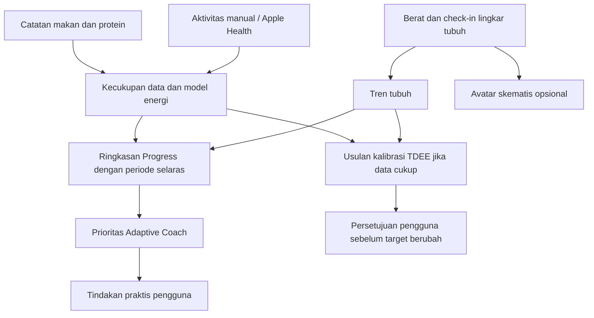

# Progress — spesifikasi visualisasi

Status: Ringkasan dan Tubuh dasar (Sprint 12) telah diimplementasikan. Panel hubungan asupan/aktivitas–tubuh serta kalibrasi TDEE tetap rancangan Sprint 13–14. Wireframe di bawah menunjukkan arah keseluruhan, bukan klaim seluruh panel sudah tersedia.

## Tujuan

Pengguna dapat menjawab: apa yang berubah, cukupkah datanya, dan apa langkah berikutnya? Satu layar mobile tidak perlu menampilkan seluruh metrik sekaligus. Label utama menggunakan bahasa Indonesia.

## Struktur layar

```text
Progress                       [14 | 28 | 56 hari]
Ringkasan     Tubuh     Fitness     Mingguan

Perubahan selama periode ini
Berat rata-rata   −0,6 kg     Pinggang   −2 cm
Catatan makan lengkap: 21/28 hari
Pengukuran pinggang: 2 tanggal

[Grafik berat + rata-rata 7 hari]
[Grafik pinggang, titik ukur bertanggal]

Aktivitas & asupan             [Lihat rincian]
[Panel asupan]                 21/28 hari lengkap
[Panel Active Energy]          18/28 hari tersedia

Langkah berikutnya
Lanjutkan pencatatan; ukur pinggang minggu depan.
```

Semua angka di wireframe adalah contoh, bukan data pengguna. Perubahan berat memakai jendela pembanding yang dijelaskan, bukan membandingkan satu titik acak dengan rata-rata. Jangan memberi label naik/turun sebagai sukses/gagal tanpa konteks goal dan kecukupan data.

## Avatar tubuh skematis — opsional

Avatar 2D netral di tab Tubuh, dengan dua tanggal pilihan: Awal dan Terbaru. Pilihan tampilan berdampingan atau overlay garis; tinggi gambar dan skala tetap sama. Tidak ada bentuk ideal, skor penampilan, wajah, atau animasi transformasi menuju target.

- Tinggi menyediakan referensi skala; pinggang, pinggul, dan paha mengontrol bagian lokal yang sesuai. Rasio lingkar/tinggi dapat dipakai sebagai parameter ilustrasi setelah pemetaan visual didokumentasikan.
- Lingkar bukan lebar tampak depan. Satu lingkar dapat mewakili banyak penampang berbeda. Avatar tidak mengklaim rekonstruksi anatomis atau ukuran lebar tubuh yang sebenarnya.
- BMI ditampilkan sebagai angka di kartu detail, bukan parameter bentuk. Berat dan body fat juga tidak dipakai menebak distribusi lemak atau otot.
- Bagian yang tidak diukur memakai garis putus-putus bertuliskan “Belum diukur”; bentuk template bukan estimasi. Tanpa tinggi, tampilkan diagram titik pengukuran dan angka, bukan avatar berskala.
- Hindari perubahan bentuk dramatis dari satu pengukuran. Utamakan callout angka dan tanggal; pemetaan visual harus monoton, terbatas, dan diuji sebelum dirilis.
- Lingkar dada/bahu belum dikumpulkan. Jangan menebak struktur rangka, bentuk dada, atau jenis tubuh dari pinggang/pinggul/BMI. Tambahkan ukuran baru hanya jika ada kebutuhan yang jelas.
- Setiap field memperlihatkan tanggal sumber. Jika pengukuran parsial berasal dari tanggal berbeda, jangan tampilkan seolah satu snapshot tubuh lengkap; default perbandingan hanya untuk field yang ada di kedua tanggal terpilih.
- Label permanen: “Ilustrasi berdasarkan ukuran tercatat; bentuk tubuh sebenarnya dapat berbeda.” Pengguna dapat menyembunyikan avatar dan memakai tabel angka.

Contoh isi panel Tubuh:

| Ukuran | 1 September (contoh) | 29 September (contoh) | Perubahan |
|---|---:|---:|---:|
| Berat | 78 kg | 77,4 kg | −0,6 kg |
| Pinggang | 92 cm | 90 cm | −2 cm |
| Pinggul | Belum diukur | Belum diukur | — |
| Paha | Belum diukur | Belum diukur | — |

Tidak menyimpulkan lemak visceral berkurang atau otot terjaga dari tabel ini.

## Visualisasi pendukung dan prioritas

| Visual | Manfaat | Aturan |
|---|---|---|
| Berat: titik + rata-rata 7 hari | Memisahkan variasi harian dari tren | Tampilkan jumlah sampel; periode kosong menjadi gap; jangan interpolasi data hilang sebagai observasi |
| Pinggang: titik bertanggal | Melihat perubahan check-in | Tidak dismoothing seperti data harian; tampilkan jarak antarukur dan panduan konsistensi |
| Kartu perubahan periode | Ringkasan cepat | Tanggal pembanding, unit, dan sumber eksplisit; jangan membuat persen tanpa baseline valid |
| Kalender kelengkapan catatan | Menjelaskan kesiapan insight | Bedakan lengkap, parsial, dan kosong; jangan menjadikannya hukuman atau streak defisit |
| Asupan vs target | Mendukung keputusan makan | Hari parsial berlabel; aktivitas tidak ditambahkan otomatis ke target |
| Panel aktivitas terpisah | Konteks kebiasaan | Bedakan nol terkonfirmasi dan tidak ada data; jangan menebak baseline dari data jarang |
| Protein dan latihan kekuatan | Konteks coach | Protein dari catatan, strength dari input yang benar-benar tersedia; jangan mengklaim massa otot |
| TDEE awal vs estimasi kalibrasi | Menjelaskan usulan target pada Sprint 14 | Rentang, coverage, asumsi, dan tombol terapkan/tetap; tanpa angka presisi palsu |

Urutan implementasi: kartu perubahan + grafik berat/pinggang → kelengkapan data → avatar opsional → panel Body Response → visual kalibrasi TDEE. Avatar tidak menjadi prasyarat pencatatan atau penghambat rilis Body Metrics.

## Hubungan fitur



Diagram menunjukkan aliran data aplikasi, bukan hubungan sebab-akibat fisiologis.

## Aksesibilitas dan empty states

- Warna bukan satu-satunya pembeda: gunakan label, bentuk titik, dan jenis garis. Perubahan naik tidak otomatis merah; turun tidak otomatis hijau.
- Grafik punya ringkasan teks dan tabel alternatif. Kontrol tanggal/periode dapat dipakai dengan keyboard, touch, dan screen reader.
- Belum ada data: ajak mencatat baseline, tanpa tubuh atau angka fiktif. Mode demo terpisah dan selalu berlabel “Data contoh”.
- Data sedikit: tampilkan titik/angka yang ada, tanpa insight tren. Data lama: tampilkan tanggal terakhir, bukan status terkini.
- Error API atau Redis: tampilkan kegagalan dan retry; jangan mengganti dengan data demo atau nol.

## Validasi sebelum implementasi selesai

Uji input parsial, koreksi historis, tanggal berbeda, satuan, timezone, data kosong, tinggi berubah, dan avatar yang dinonaktifkan. Verifikasi visualisasi selalu punya angka sumber yang sesuai; transformasi avatar tidak mengubah data. Uji tampilan mobile dan aksesibilitas. Threshold insight Sprint 13 telah ditetapkan dan diuji pada [kebijakan Body Response](body-response-data-policy.md); threshold kalibrasi Sprint 14 telah ditetapkan dan diuji pada [kebijakan kalibrasi](calibration-data-policy.md); smoothing kalender dan pemetaan avatar dasar sudah diuji pada Sprint 12. Dokumen ini tidak menyatakan validasi klinis.

## Pemetaan avatar yang diimplementasikan

Lebar setengah segmen pinggang/pinggul = clamp(lingkar / tinggi × 48, 12, 44) dalam unit SVG; segmen paha memakai setengah parameter tersebut. Ini pemetaan visual monoton dengan batas perubahan, bukan rumus lebar anatomis. Bahu, kepala, lengan, dan kaki bawah adalah template putus-putus. Dua avatar dengan tinggi diketahui memakai tinggi referensi bersama dan skala yang sama; bila referensi ukuran dalam satu tanggal tidak konsisten, tanggal tersebut tampil tanpa skala. BMI/berat/body fat tidak menjadi parameter bentuk.

Perbandingan memakai dua tanggal yang dipilih. Selisih hanya muncul untuk field yang ada di kedua tanggal dan urutan tanggal yang benar. Ringkasan periode memakai ukuran pertama/terakhir per field dengan tanggal aktualnya, bukan menyebut selisih itu sebagai rata-rata atau respons kausal.

## Panel Body Response yang diimplementasikan

Ringkasan menyediakan periode 14/28/56 hari, coverage/kesiapan per metrik, dan perbandingan dengan periode sebelumnya yang sama panjang. Grafik asupan, protein, aktivitas, berat, dan pinggang memakai panel terpisah dengan tanggal selaras; titik kosong tidak dihubungkan. Tabel alternatif tetap menampilkan catatan parsial. Perubahan berat memakai selisih rata-rata jendela 7 hari awal/akhir; perubahan pinggang memakai tanggal ukur aktual. Insight deskriptif menunggu kecukupan data dan pemeriksaan nilai; target pengguna tidak berubah.

## Evaluasi target yang diimplementasikan

Panel terpisah memakai 28 hari tertutup sampai kemarin, terlepas dari pilihan grafik. Menampilkan target aktif, maintenance profil, estimasi maintenance beserta rentang sensitivitas, coverage, alasan penundaan/usulan, dan dua keputusan: terapkan atau tetap. Konfirmasi konteks diperlukan untuk menerapkan; target protein tetap. Periode, riwayat keputusan terbaru, dan tanggal evaluasi ulang terlihat. Tidak memakai diagram yang menyiratkan presisi metabolisme.
